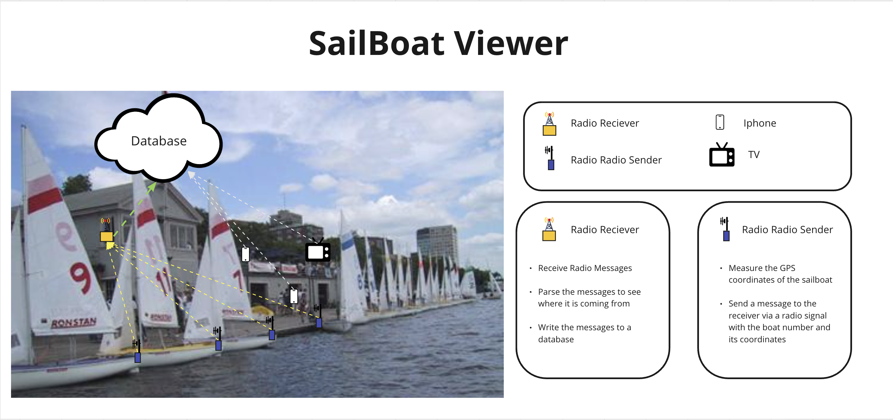
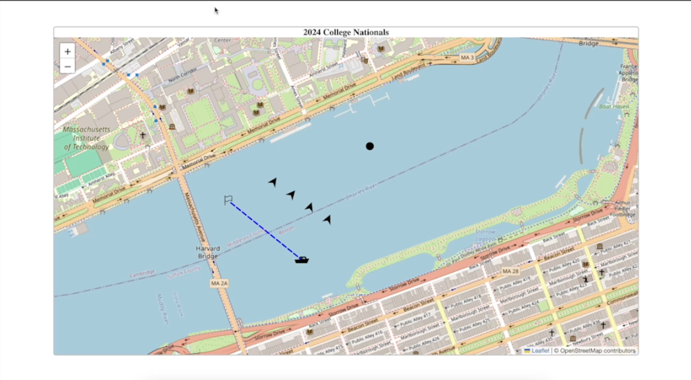

# [College Nationals Sailing Race Viewer](https://sailviewer.netlify.app/)

Welcome to the College Nationals Sailing Race Viewer, your go-to app for tracking and visualizing the exciting sailing races happening at the 2024 College Nationals! 

Whether you're a participant, a sailing enthusiast, or just curious about the action on the water, our app provides a dynamic and interactive experience to keep you engaged with the regatta.

### Diagram:
Our product includes GPS devcies to measure the position of each boat, a database to store the data, and a website to display the data.

### Features:
Live Race Tracking: Stay up-to-date with real-time tracking of participating sailboats during the races. Follow the thrilling moments as teams compete for victory.

Course Overview: Explore the race course with detailed maps and markers for key points such as starting lines, buoys, and the finish line. Get insights into the strategic decisions made by the sailors.

Boat Details: Learn more about each participating sailboat, including team information, boat specifications, and current positioning on the course.

Leaderboard: Keep an eye on the leaderboard to see which teams are leading the pack. Track changes in rankings as the races progress.

Interactive Experience: Enjoy an immersive experience with interactive maps, dynamic visuals, and real-time updates. Zoom in to get a closer look or pan around to explore different parts of the race course.

